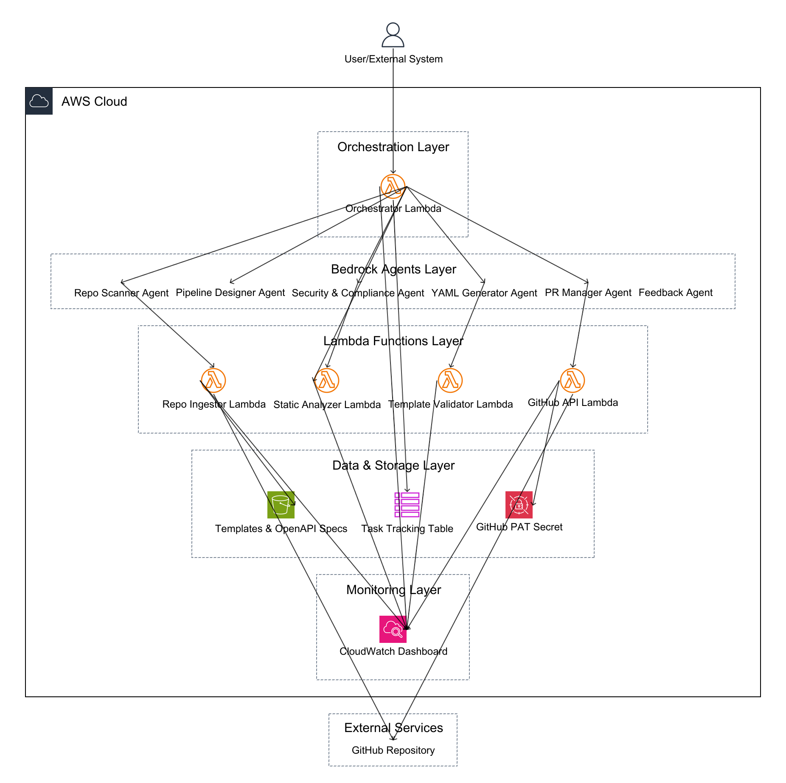

# Multi-Agent Architecture Implementation

## Architecture Diagram



The architecture diagram above illustrates the complete system architecture, showing the flow from user invocation through the orchestrator, agents, Lambda functions, and AWS services.

## Overview

This implementation provides a complete multi-agent architecture for automated CI/CD pipeline generation using Amazon Bedrock Agents. The system consists of 6 specialized agents, 6 Lambda functions, and an orchestrator to coordinate the workflow.

## Architecture Components

### 1. Orchestrator/Controller

**Lambda Function:** `orchestrator.py`

- Coordinates all agents and tracks tasks
- Manages workflow between different agents
- Uses DynamoDB for task state tracking
- Invokes agents in sequence based on workflow requirements

### 2. Repository Ingestor

**Lambda Function:** `repo_ingestor.py`

- Clones repository from GitHub
- Extracts manifest files:
  - Dockerfiles
  - Package manifests (package.json, requirements.txt, pom.xml, etc.)
  - Infrastructure as Code (Terraform, CloudFormation)
  - Kubernetes manifests
  - Helm charts
- Returns structured JSON with all extracted content

### 3. Static Analyzers & Scanners

**Lambda Function:** `static_analyzer.py`

- Analyzes Dockerfiles for best practices and security issues
- Detects dependencies from manifest files
- Identifies test frameworks and test files
- Provides vulnerability scanning foundation (ready for Trivy/Snyk integration)

### 4. Template Engine & Validator

**Lambda Function:** `template_validator.py`

- Validates GitHub Actions YAML syntax
- Checks for security issues (hardcoded secrets, etc.)
- Validates secrets usage
- Checks IAM permissions and least privilege
- Returns validation results with errors and warnings

## Bedrock Agents

### 1. Repo Scanner Agent

**Purpose:** Scans repositories and builds inventory

- Identifies languages, frameworks, build systems
- Detects containers, tests, infrastructure targets
- Uses Repository Ingestor Lambda via action group

### 2. Pipeline Designer Agent

**Purpose:** Designs CI/CD pipeline stages

- Decides build/test/lint/scan/image stages
- Designs matrix strategy, caching, artifacts
- Considers repository analysis results

### 3. Security & Compliance Agent

**Purpose:** Ensures security and compliance

- Validates SAST/SCA scanning inclusion
- Ensures secrets scanning
- Validates least privilege IAM permissions
- Uses Static Analyzer Lambda via action group

### 4. YAML Generator Agent

**Purpose:** Generates GitHub Actions YAML

- Converts pipeline design to concrete YAML
- Includes proper AWS credentials configuration
- Manages secrets properly
- Uses Template Validator Lambda via action group for validation

### 5. PR Manager Agent

**Purpose:** Creates GitHub PRs

- Creates pull requests with generated workflows
- Populates PR description with rationale
- Lists required secrets and permissions
- Uses GitHub API via OpenAPI action group

### 6. Feedback Agent

**Purpose:** Analyzes CI run logs and suggests improvements

- Reads GitHub Actions run logs
- Suggests caching optimizations
- Identifies parallelization opportunities
- Provides build time reduction recommendations

## Workflow

The workflow follows a sequential orchestration pattern as shown in the architecture diagram. Each step builds upon the previous step's output:

```
1. User/External System invokes Orchestrator Lambda
   - Input: repo_url, branch, agent_ids
   - Orchestrator creates task record in DynamoDB
   ↓
2. Orchestrator invokes Repo Scanner Agent
   - Agent analyzes repository requirements
   ↓
3. Repo Scanner Agent calls Repository Ingestor Lambda (via Action Group)
   - Lambda clones GitHub repository
   - Extracts manifest files (Dockerfiles, package.json, etc.)
   - Returns structured JSON with repository contents
   ↓
4. Orchestrator invokes Static Analyzer Lambda (direct invocation)
   - Analyzes Dockerfiles, dependencies, test frameworks
   - Returns security and dependency analysis
   ↓
5. Orchestrator invokes Pipeline Designer Agent
   - Agent receives repository analysis and static analysis results
   - Designs CI/CD pipeline stages (build, test, scan, deploy)
   ↓
6. Orchestrator invokes Security & Compliance Agent
   - Agent reviews pipeline design for security best practices
   - Security Agent calls Static Analyzer Lambda (via Action Group) if needed
   - Ensures SAST/SCA scanning, secrets management, least privilege
   ↓
7. Orchestrator invokes YAML Generator Agent
   - Agent converts pipeline design to GitHub Actions YAML
   ↓
8. YAML Generator Agent calls Template Validator Lambda (via Action Group)
   - Validates YAML syntax
   - Checks for security issues (hardcoded secrets, etc.)
   - Validates IAM permissions
   ↓
9. Orchestrator invokes PR Manager Agent
   - Agent prepares PR description and files
   ↓
10. PR Manager Agent calls GitHub API Lambda (via Action Group)
    - Lambda retrieves GitHub PAT from Secrets Manager
    - Creates branch, commits workflow files
    - Creates draft PR with comprehensive description
    ↓
11. Orchestrator updates DynamoDB with completion status
    - All workflow steps and results stored
```

### Data Flow

- **Task State**: Orchestrator tracks workflow progress in DynamoDB
- **Repository Data**: Repo Ingestor clones from GitHub, extracts manifests
- **OpenAPI Specs**: Lambda functions read OpenAPI schemas from S3 for Bedrock action groups
- **Secrets**: GitHub API Lambda retrieves GitHub PAT from Secrets Manager
- **Monitoring**: All Lambda functions send metrics and logs to CloudWatch

## Infrastructure Components

### AWS Resources

1. **S3 Bucket** (`templates`)

   - Stores OpenAPI specifications
   - Stores CI/CD templates
   - Stores Lambda deployment packages

2. **DynamoDB Table** (`task_tracking`)

   - Tracks workflow execution state
   - Stores task results
   - Enables workflow resumption

3. **Lambda Functions**

   - `repo_scanner` - Original scanner (backward compatibility)
   - `repo_ingestor` - Enhanced repository ingestion
   - `static_analyzer` - Security and dependency analysis
   - `template_validator` - YAML validation
   - `orchestrator` - Workflow coordination

4. **Bedrock Agents** (6 agents)

   - Each agent has specialized instructions
   - Connected to Lambda functions via action groups
   - Can invoke other agents via Bedrock runtime API

5. **IAM Roles & Policies**

   - Lambda execution role with necessary permissions
   - Bedrock agent role for invoking Lambdas and agents
   - Least privilege access patterns

6. **Secrets Manager**
   - Stores GitHub Personal Access Token
   - Accessed by agents via action groups

## Usage

### Invoking the Orchestrator

```python
import boto3

lambda_client = boto3.client('lambda')

response = lambda_client.invoke(
    FunctionName='bedrock-ci-agent-orchestrator',
    Payload=json.dumps({
        'task_id': 'unique-task-id',
        'repo_url': 'https://github.com/owner/repo',
        'branch': 'main',
        'agent_ids': {
            'repo_scanner': 'agent-id-1',
            'pipeline_designer': 'agent-id-2',
            'security_compliance': 'agent-id-3',
            'yaml_generator': 'agent-id-4',
            'pr_manager': 'agent-id-5'
        }
    })
)
```

### Direct Agent Invocation

```python
import boto3

bedrock_runtime = boto3.client('bedrock-agent-runtime')

response = bedrock_runtime.invoke_agent(
    agentId='repo-scanner-agent-id',
    agentAliasId='TSTALIASID',
    sessionId='session-123',
    inputText='Analyze repository: https://github.com/example/repo'
)
```

## Deployment

1. **Update terraform.tfvars** with your values
2. **Run terraform init**
3. **Run terraform apply**
4. **Update GitHub PAT** in Secrets Manager
5. **Get agent IDs** from Terraform outputs
6. **Invoke orchestrator** with agent IDs

## Next Steps

1. **Create Knowledge Bases** for CI/CD best practices
2. **Implement GitHub API Lambda** for PR creation
3. **Add Trivy/Snyk integration** to Static Analyzer
4. **Implement Feedback Agent** log reading from GitHub API
5. **Add monitoring and observability** (CloudWatch dashboards)
6. **Implement retry logic** in orchestrator
7. **Add human-in-the-loop** approval gates

## Notes

- All agents use Claude 3.5 Sonnet by default (configurable via variable)
- Action groups are configured with DRAFT version (update after testing)
- GitHub PAT must be updated in Secrets Manager after deployment
- Lambda functions share the same deployment package for efficiency
- DynamoDB table uses pay-per-request billing mode
